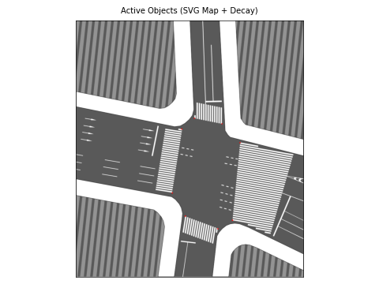

# TrafficLab 3D Paths Visualization Tool

This repository visualizes the data output from my [TrafficLab 3D](https://github.com/duy-phamduc68/TrafficLab-3D) tool (in which has preprocessed data for Shinjukugado W.). Two modes visualization modes are provided: `paths` and `objects`.

## Paths Visualization


## Objects Visualization



---

To reproduce the results and use the viewers, you can visit this [Google Drive](https://drive.google.com/drive/folders/14NVnbrUUfII3tRdI8OOEPnLzKbs3SPvn?usp=drive_link), download the `SHINJUKU1` folder, then place it at `data/SHINJUKU1`.

An example folder structure is provided below:

```
.
├── .gitignore
├── data
│   └── SHINJUKU1
│       ├── footage [directory]
│       ├── illustrator [directory]
│       ├── cctv_SHINJUKU1.png
│       ├── G_projection_SHINJUKU1.json [critical]
│       ├── layout_SHINJUKU1.svg [critical]
│       ├── roi_SHINJUKU1.png
│       ├── sat_SHINJUKU1.png [critical]
│       └── output [directory]
│           └── FULL_SHINJUKU1_2025-12-26_I... [critical]
├── objects_gif.py
├── objects_viewer.py
├── paths_gif.py
├── paths_viewer.py
├── requirements.txt
├── shinjuku_objects_optimized.gif
└── shinjuku_paths_optimized.gif
```

---

Data was collected from this [Youtube Livestream](https://www.youtube.com/watch?v=6dp-bvQ7RWo).